# Proyecto de Clasificación de Imágenes con CNN

## 🌍 Versiones Multilingües del README

- 🇫🇷 [Francés](./README.fr.md)
- 🇬🇧 [Inglés](./README.md)
- 🇪🇸 [Español (estás aquí)](#)

---

## 📘 Resumen del Proyecto

Este proyecto, realizado como parte de mi Máster, tiene como objetivo crear un **sistema de clasificación de imágenes** utilizando **Redes Neuronales Convolucionales (CNNs)** con **Keras**. El proyecto implica el raspado de imágenes para construir conjuntos de datos, seguido del entrenamiento de modelos CNN para la clasificación.

---

## 📁 Estructura del Proyecto

Este proyecto está organizado en varias carpetas principales, cada una conteniendo elementos específicos:

* `code/`: Esta carpeta reúne todos los scripts de Python y notebooks de Jupyter dedicados a la **creación**, **entrenamiento** y **carga** de modelos de clasificación.
* `data/`: Esta carpeta contiene los diversos **conjuntos de datos** del proyecto, incluyendo **Dragon Ball**, **Fairy Tail** y **Pokémon**, organizados para entrenamiento, validación y predicción.
* `modele/`: Esta carpeta almacena los **modelos CNN entrenados y guardados** para cada conjunto de datos, incluyendo su arquitectura, pesos y etiquetas de clase asociadas.

```
code/
├── Creer_model.ipynb   # Notebook de Jupyter para la creación del modelo
├── creer_model.py      # Script de Python para la creación del modelo
├── Load_model.ipynb    # Notebook de Jupyter para la carga del modelo
└── load_model.py       # Script de Python para la carga del modelo
data/
├── dragonball/
│   ├── predict/    # Imágenes para predicción
│   ├── train/      # Imágenes para entrenamiento
│   │   ├── gohan/
│   │   ├── goku/
│   │   ├── piccolo/
│   │   └── vegeta/
│   └── validation/ # Imágenes para validación
│       ├── gohan/
│       ├── goku/
│       ├── piccolo/
│       └── vegeta/
├── fairytail/
│   ├── predict/    # Imágenes para predicción
│   ├── train/      # Imágenes para entrenamiento
│   │   ├── erza_scarlet/
│   │   ├── grey_fullbuster/
│   │   ├── lucy_heartfilia/
│   │   └── natsu_dragneel/
│   └── validation/ # Imágenes para validación
│       ├── erza_scarlet/
│       ├── grey_fullbuster/
│       ├── lucy_heartfilia/
│       └── natsu_dragneel/
└── pokemon/
├── predict/    # Imágenes para predicción
├── train/      # Imágenes para entrenamiento
│   ├── bulbasaur/
│   ├── charmander/
│   ├── pikachu/
│   └── squirtle/
└── validation/ # Imágenes para validación
├── bulbasaur/
├── charmander/
├── pikachu/
└── squirtle/
modele/
├── dragonball_model/
│   ├── architecture.json  # Arquitectura del modelo
│   ├── poids.h5           # Pesos del modelo
│   └── labels.txt         # Etiquetas de clase
├── fairytail_model/
│   ├── architecture.json  # Arquitectura del modelo
│   ├── poids.h5           # Pesos del modelo
│   └── labels.txt         # Etiquetas de clase
└── pokemon_model/
├── architecture.json  # Arquitectura del modelo
├── poids.h5           # Pesos del modelo
└── labels.txt         # Etiquetas de clase

```

---

## 📊 Conjuntos de Datos

Para este proyecto, creamos **tres conjuntos de datos distintos**, cada uno compuesto por **cuatro clases**. Las imágenes se obtuvieron principalmente de **Google Images** y **Anime Characters Database**.

* **Dragon Ball**
    * Entrenamiento: Gohan (34), Goku (42), Piccolo (20), Vegeta (44)
    * Validación: Gohan (5), Goku (21), Piccolo (7), Vegeta (15)


* **Fairy Tail**
    * Entrenamiento: Erza Scarlet (22), Grey Fullbuster (15), Lucy Heartfilia (25), Natsu Dragneel (13)
    * Validación: Erza Scarlet (5), Grey Fullbuster (5), Lucy Heartfilia (6), Natsu Dragneel (6)


* **Pokémon**
    * Entrenamiento: Bulbasaur (100), Charmander (96), Pikachu (156), Squirtle (102)
    * Validación: Bulbasaur (30), Charmander (23), Pikachu (38), Squirtle (28)

---

## 🖼️ Aumento de Datos (Data Augmentation)

El aumento de datos es una técnica esencial para **mejorar la robustez del modelo** y **prevenir el sobreajuste**, creando nuevas imágenes de entrenamiento a partir de las existentes. A continuación, se presentan las transformaciones aplicadas en este proyecto:

* 📏 **Reescalado**: Los valores de los píxeles de las imágenes se escalan a un rango entre 0 y 1. Este es un paso crucial de **normalización** para el procesamiento de la red neuronal.


* ✂️ **Corte (Shear Range)**: Las imágenes se "sesgan" o distorsionan a lo largo de un eje. Esto ayuda al modelo a reconocer objetos desde **varios ángulos o perspectivas**.


* 🔍 **Zoom (Zoom Range)**: Se aplican zooms aleatorios a las imágenes. Esta transformación permite al modelo identificar mejor las características, independientemente de su **tamaño o distancia relativa** dentro de la imagen.


* ↔️ **Volteo Horizontal (Horizontal Flip)**: Las imágenes se voltean horizontalmente de forma aleatoria. Esto es particularmente útil para objetos que pueden aparecer en cualquier **orientación lateral**, como la mayoría de los personajes u objetos.

---

## ⚙️ Cómo Funciona una CNN

Una **Red Neuronal Convolucional (CNN)** es un tipo de red neuronal diseñado específicamente para procesar datos con una estructura de cuadrícula, como las imágenes. Su eficacia radica en su capacidad para aprender automáticamente características (o "features") relevantes directamente de las imágenes, sin intervención humana.

Así es como opera, paso a paso:

* 🔎 **Extracción de Características (Capas Convolucionales)**: En el corazón de una CNN se encuentran las capas convolucionales. Estas aplican "filtros" (pequeñas matrices de números) a través de la imagen. Cada filtro está diseñado para detectar un tipo específico de patrón, como **bordes**, **texturas** o **formas simples**. Al deslizar este filtro por toda la imagen, la capa convolucional crea un "mapa" que indica dónde están presentes estos patrones y con qué intensidad. La red aprende progresivamente qué filtros son más útiles para la tarea dada.


* 🔽 **Reducción de Complejidad (Capas de Pooling)**: Después de la convolución, entran en juego las capas de *pooling*. Su función es **reducir la dimensionalidad** de los mapas de características. Agregan información reteniendo solo los valores más significativos (por ejemplo, el valor máximo en una pequeña región). Esto ayuda a que el modelo sea más robusto a pequeñas variaciones en la posición de los patrones y a reducir el costo computacional.


* 🧠 **Aprendizaje de Patrones Complejos y Clasificación (Capas Densas)**: La información procesada y simplificada por las capas convolucionales y de pooling es luego "aplanada" y alimentada a capas de neuronas llamadas "densas" o "totalmente conectadas". Aquí es donde la red aprende a **combinar características de alto nivel** detectadas anteriormente para identificar patrones más complejos y, finalmente, tomar una **decisión de clasificación**. Por ejemplo, después de detectar ojos y una nariz, las capas densas aprenderán a ensamblarlos para reconocer una cara específica.

Al repetir este proceso a través de varias capas convolucionales y de pooling, seguidas de capas densas, la CNN construye una **representación jerárquica** de la imagen, pasando de las características más simples (bordes) a las más complejas (objetos enteros), lo que le permite clasificar imágenes con alta precisión.

---

## 🧱 Arquitectura de la CNN

Aquí se muestra un diagrama de la arquitectura de nuestro modelo CNN, que ilustra el flujo de datos a través de sus diferentes capas:

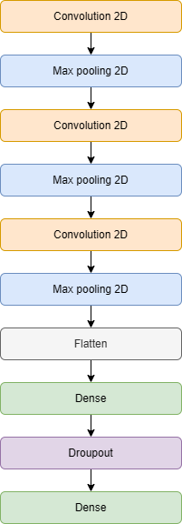

---

## 🧪 Resultados y Enfoque Experimental

Este proyecto siguió un enfoque experimental progresivo, con el objetivo de explorar las capacidades y limitaciones de las CNN en la clasificación de imágenes de personajes de manga y anime.

### 1. Clasificación de Pokémon

Comenzamos entrenando nuestros modelos con el conjunto de datos de Pokémon, compuesto por cuatro clases (Bulbasaur, Charmander, Pikachu, Squirtle). El objetivo inicial era validar la arquitectura básica de la CNN y obtener un rendimiento satisfactorio en una tarea relativamente simple.

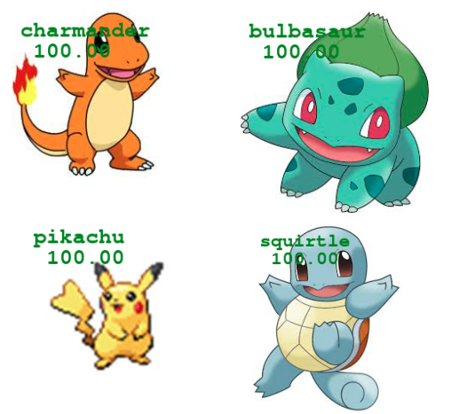

*Ejemplo de predicciones exitosas en imágenes de Pokémon.*

### 2. Detección de Evoluciones

Luego, probamos la capacidad del modelo para generalizar a imágenes de evoluciones de Pokémon (por ejemplo, Bulbasaur, Ivysaur, Venusaur). La idea era ver si el modelo podía atribuir correctamente una imagen a la clase de su pre-evolución, incluso si la imagen mostraba diferencias visuales significativas.

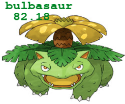

*Resultados de la clasificación de evoluciones de Pokémon.*

### 3. Detección Múltiple y Fusiones en Dragon Ball

Pasando a un conjunto de datos más complejo (Dragon Ball), exploramos la detección de múltiples personajes dentro de la misma imagen.

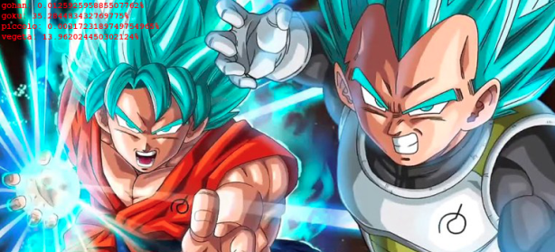

*Ejemplos de detección de múltiples personajes en la misma imagen.*

También probamos el modelo con imágenes de fusiones (como Gogeta), donde un personaje está visualmente compuesto por partes de otros dos (Goku y Vegeta). El objetivo era ver si el modelo podía identificar similitudes con los personajes "padres".

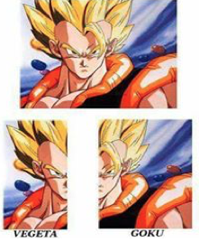

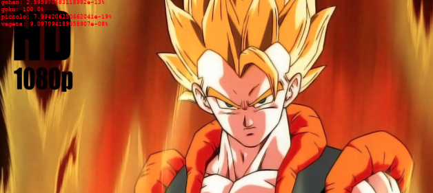
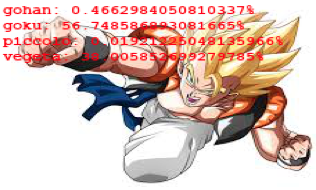

*Predicción en imágenes de Gogeta.*

Finalmente, probamos el modelo con imágenes de Trunks (el hijo de Vegeta) para ver si podía detectar rasgos comunes con su padre, a pesar de las notables diferencias visuales.

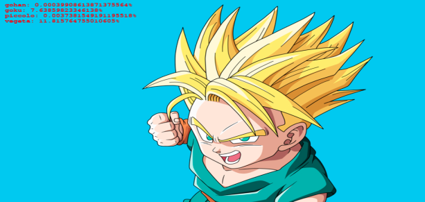
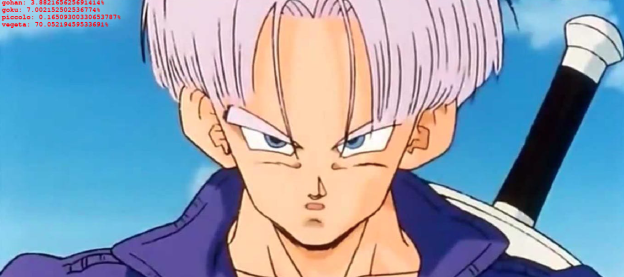

*Predicción en imágenes de Trunks.*

### 4. Explicabilidad de los Resultados

Para comprender mejor las decisiones del modelo, exploramos técnicas de explicabilidad.

* **Visualización de Mapas de Características**: Extraímos los *mapas de características* de las capas convolucionales para visualizar los patrones que el modelo aprendió a detectar. Por ejemplo, pudimos observar mapas que resaltaban la silueta general de un personaje, o partes específicas como brazos o piernas.

    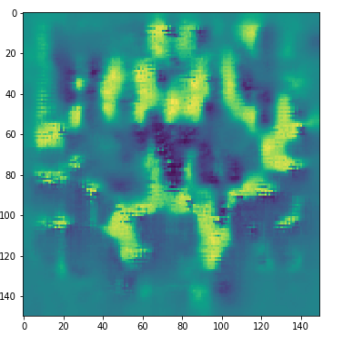

    *Ejemplo de mapas de características que muestran la extracción de patrones en una imagen de manga.*


* **Mapas de Salience**: Generamos mapas de salience, que indican las regiones más importantes de la imagen para la predicción del modelo. Aplicamos esta técnica a imágenes de Dragon Ball.

    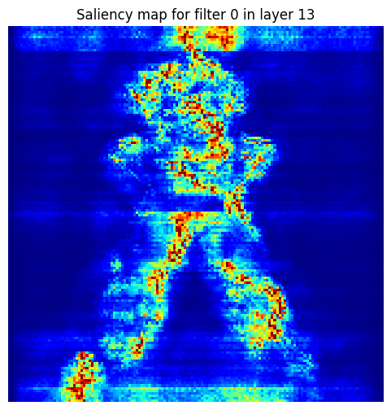
    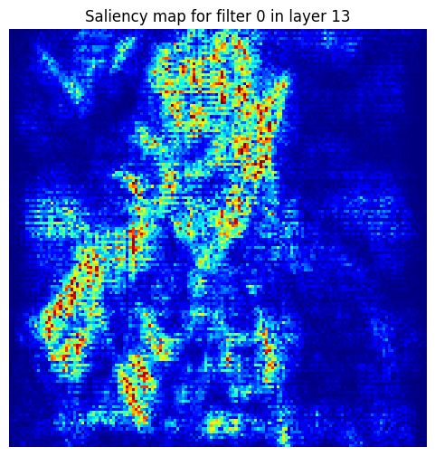

    *Mapa de salience para imágenes de Dragon Ball.*

    
Además, visualizamos los mapas de salience para cada bloque convolucional durante la predicción de un personaje de Fairy Tail, para observar cómo evolucionan las regiones importantes a medida que la CNN procesa la imagen.

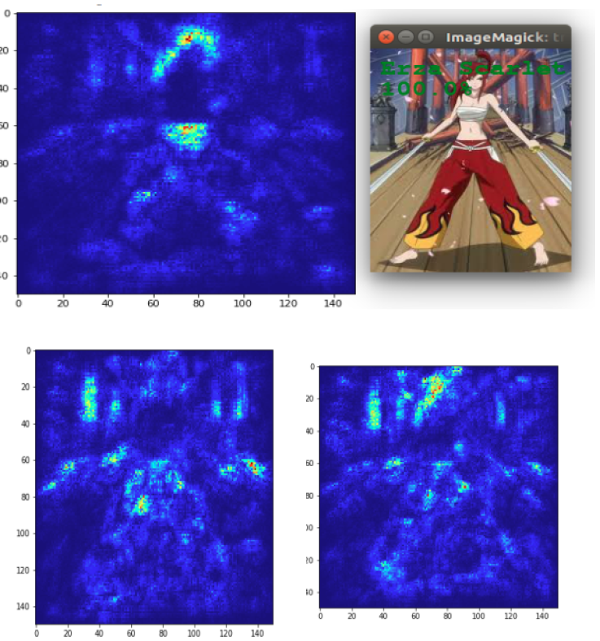

*Mapas de salience para cada bloque convolucional durante la predicción de un personaje de Fairy Tail.*

---

## 💻 Tecnologías Utilizadas

* **Lenguaje:** Python
* **Librerías:** Keras

---

## 🚀 Cómo Ejecutar el Proyecto

Para iniciar este proyecto y utilizar los modelos de clasificación de imágenes, sigue estos pasos:

1.  **Clonar el repositorio**:
    ```
    git clone https://github.com/Fab16BSB/image_classification.git
    ```

2.  **Instalar las dependencias**:
    ```
    cd image_classification
    pip install -r requirements.txt
    ```

3.  **Ejecutar el código**:

* Para **crear y entrenar un nuevo modelo**, utiliza los archivos de la carpeta `code/`:
    * Desde Jupyter Notebook: Abre `Creer_model.ipynb` y ejecuta las celdas.
    * Desde un script de Python: Ejecuta `python code/creer_model.py` desde la raíz del proyecto.


* Para **cargar un modelo existente y hacer predicciones**, utiliza los archivos de la carpeta `code/`:
    * Desde Jupyter Notebook: Abre `Load_model.ipynb` y ejecuta las celdas.
    * Desde un script de Python: Ejecuta `python code/load_model.py` desde la raíz del proyecto.

---

## 🧑‍💻 Autores

* **Zeineb Ghrib**: Contribuyó a la construcción del conjunto de datos de Pokémon y participó en la creación del modelo CNN.

---

## 📚 Fuentes

Los datos utilizados para este proyecto fueron recolectados de las siguientes plataformas, con fuentes específicas para cada conjunto de datos:

* **Google Images**: Utilizado para el raspado del conjunto de datos de Pokémon.
* **Anime Characters Database**: La fuente utilizada para los conjuntos de datos de Dragon Ball y Fairy Tail.