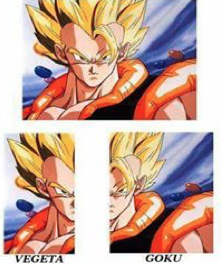
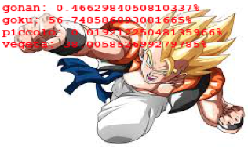
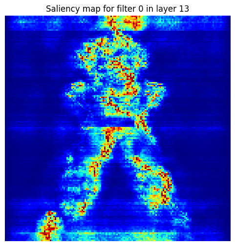

# Projet de Classification d'Images avec CNN

## 🌍 Versions multilingues du README

- 🇫🇷 [Français (vous êtes ici)](#)
- 🇬🇧 [English](./README.md)
- 🇪🇸 [Español](./README.es.md)

---

 ## 📘 Aperçu du Projet

 Ce projet, réalisé dans le cadre de mon Master, a pour objectif de créer un système de classification d'images en utilisant des réseaux de neurones convolutifs (CNN) avec Keras. Le projet implique le scraping d'images pour constituer des datasets, puis l'entraînement de modèles CNN pour la classification.

 ---

 ## 📁 Structure du Projet
Ce projet est organisé en plusieurs dossiers, chacun contenant des éléments spécifiques : 

- code: Ce dossier rassemble tous les scripts Python et notebooks Jupyter dédiés à la création, l'entraînement, et le chargement des modèles de classification.
- data: Ce dossier contient les différents jeux de données du projet, incluant Dragon Ball, Fairy Tail, et Pokémon, organisés pour l'entraînement, la validation et la prédiction.
- modele: Ce dossier stocke les modèles de CNN entraînés et sauvegardés pour chaque jeu de données, comprenant leur architecture, leurs poids, et les étiquettes de classes associées.

```
code/
├── Creer_model.ipynb   # Notebook Jupyter pour la création du modèle
├── creer_model.py      # Script Python pour la création du modèle
├── Load_model.ipynb    # Notebook Jupyter pour le chargement du modèle
└── load_model.py       # Script Python pour le chargement du modèle
data/
├── dragonball/
│   ├── predict/    # Images à prédire
│   ├── train/      # Images d'entraînement
│   │   ├── gohan/
│   │   ├── goku/
│   │   ├── piccolo/
│   │   └── vegeta/
│   └── validation/ # Images de validation
│       ├── gohan/
│       ├── goku/
│       ├── piccolo/
│       └── vegeta/
├── fairytail/
│   ├── predict/    # Images à prédire
│   ├── train/      # Images d'entraînement
│   │   ├── erza_scarlet/
│   │   ├── grey_fullbuster/
│   │   ├── lucy_heartfilia/
│   │   └── natsu_dragneel/
│   └── validation/ # Images de validation
│       ├── erza_scarlet/
│       ├── grey_fullbuster/
│       ├── lucy_heartheartfilia/
│       └── natsu_dragneel/
└── pokemon/
├── predict/    # Images à prédire
├── train/      # Images d'entraînement
│   ├── bulbasaur/
│   ├── charmander/
│   ├── pikachu/
│   └── squirtle/
└── validation/ # Images de validation
├── bulbasaur/
├── charmander/
├── pikachu/
└── squirtle/
modele/
├── dragonball_model/
│   ├── architecture.json  # Architecture du modèle
│   ├── poids.h5           # Poids du modèle
│   └── labels.txt         # Labels des classes
├── fairytail_model/
│   ├── architecture.json  # Architecture du modèle
│   ├── poids.h5           # Poids du modèle
│   └── labels.txt         # Labels des classes
└── pokemon_model/
├── architecture.json  # Architecture du modèle
├── poids.h5           # Poids du modèle
└── labels.txt         # Labels des classes
```


---

## 📊 Datasets
Pour ce projet, nous avons constitué **trois datasets distincts**, chacun composé de **quatre classes**. Les images ont été récupérées (scrappées) principalement depuis **Google Images** et **Anime Characters Database**.

* **Dragon Ball**
    * Train: Gohan (34), Goku (42), Piccolo (20), Vegeta (44)
    * Validation: Gohan (5), Goku (21), Piccolo (7), Vegeta (15)


* **Fairy Tail**
    * Train: Erza Scarlet (22), Grey Fullbuster (15), Lucy Heartfilia (25), Natsu Dragneel (13)
    * Validation: Erza Scarlet (5), Grey Fullbuster (5), Lucy Heartfilia (6), Natsu Dragneel (6)


* **Pokémon**
    * Train: Bulbasaur (100), Charmander (96), Pikachu (156), Squirtle (102)
    * Validation: Bulbasaur (30), Charmander (23), Pikachu (38), Squirtle (28)

---

## 🖼️ Data Augmentation
La data augmentation est une technique essentielle pour améliorer la robustesse des modèles et prévenir le surapprentissage, en créant de nouvelles images d'entraînement à partir de celles existantes. Voici les transformations appliquées dans ce projet :

📏 Redimensionnement (Rescale): Les valeurs des pixels des images sont ramenées entre 0 et 1. C'est une étape de normalisation cruciale pour le traitement par le réseau de neurones.

✂️ Cisaillement (Shear Range): Les images sont "inclinées" ou déformées le long d'un axe. Cela aide le modèle à reconnaître les objets sous des angles ou perspectives variés.

🔍 Zoom (Zoom Range): Des zooms aléatoires sont appliqués sur les images. Cette transformation permet au modèle de mieux identifier les caractéristiques, quelle que soit leur taille ou leur distance relative dans l'image.

↔️ Retournement Horizontal (Horizontal Flip): Les images sont retournées horizontalement de manière aléatoire. Cela est particulièrement utile pour des objets qui peuvent apparaître dans n'importe quelle orientation latérale, comme la plupart des personnages ou objets.

---

## ⚙️ Fonctionnement d'un réseau de neuronne de type CNN

 Un **réseau de neurones convolutif (CNN)** est un type de réseau de neurones spécialement conçu pour traiter des données ayant une structure de grille, comme les images. Son efficacité réside dans sa capacité à apprendre automatiquement les caractéristiques (ou "features") pertinentes directement à partir des images, sans intervention humaine.

 Voici comment il opère, étape par étape :

 * 🔎 **Extraction de caractéristiques (Couches de Convolution)** : Au cœur du CNN se trouvent les couches de convolution. Elles appliquent des "filtres" (de petites matrices de nombres) sur l'image. Chaque filtre est conçu pour détecter un type spécifique de motif, comme des **bords**, des **textures** ou des **formes simples**. En glissant ce filtre sur toute l'image, la couche de convolution crée une "carte" qui indique où ces motifs sont présents et avec quelle intensité. Le réseau apprend progressivement quels filtres sont les plus utiles pour la tâche donnée.


 * 🔽 **Réduction de la complexité (Couches de Pooling)** : Après la convolution, les couches de *pooling* interviennent. Leur rôle est de **réduire la dimensionnalité** des cartes de caractéristiques. Elles agrègent l'information en ne conservant que les valeurs les plus significatives (par exemple, la valeur maximale dans une petite région). Cela aide à rendre le modèle plus robuste aux petites variations de position des motifs et à diminuer le coût computationnel.


 * 🧠 **Apprentissage de motifs complexes et classification (Couches Denses)** : Les informations traitées et simplifiées par les couches de convolution et de pooling sont ensuite "aplaties" et alimentent des couches de neurones dites "denses" ou "entièrement connectées". C'est ici que le réseau apprend à **combiner les caractéristiques de haut niveau** détectées précédemment pour identifier des motifs plus complexes et, finalement, prendre une **décision de classification**. Par exemple, après avoir détecté des yeux et un nez, les couches denses apprendront à les assembler pour reconnaître un visage spécifique.

 En répétant ce processus à travers plusieurs couches de convolution et de pooling, suivies de couches denses, le CNN construit une **représentation hiérarchique** de l'image, allant des caractéristiques les plus simples (bords) aux plus complexes (objets entiers), ce qui lui permet de classer les images avec une grande précision.

 ---

## 🧱 Architecture du CNN 

Voici le schéma de l'architecture de notre modèle CNN, illustrant le flux des données à travers les différentes couches :


---

## 🧪 Résultats et Démarche Expérimentale

Ce projet a suivi une démarche expérimentale progressive, visant à explorer les capacités et les limites des CNN dans la classification d'images de personnages de manga et d'anime.

### 1. Classification de Pokémon

Nous avons commencé par entraîner nos modèles sur le dataset Pokémon, composé de quatre classes (Bulbasaur, Charmander, Pikachu, Squirtle). L'objectif initial était de valider l'architecture de base du CNN et d'obtenir des performances satisfaisantes sur une tâche relativement simple.


*Exemple de prédictions réussies sur des images de Pokémon.*

### 2. Détection d'Évolutions

Nous avons ensuite testé la capacité du modèle à généraliser sur des images d'évolutions de Pokémon (par exemple, Bulbizarre, Herbizarre, Florizarre). L'idée était de voir si le modèle pouvait attribuer correctement une image à la classe de sa pré-évolution, même si l'image présentait des différences visuelles significatives.


*Résultats de la classification d'évolutions de Pokémon.*

### 3. Détection Multiple et Fusions dans Dragon Ball

Passant à un dataset plus complexe (Dragon Ball), nous avons exploré la détection de plusieurs personnages dans une même image.


*Exemples de détection de plusieurs personnages dans une même image.*

Nous avons également testé le modèle sur des images de fusions (comme Gogeta), où un personnage est visuellement composé de parties de deux autres (Goku et Vegeta). L'objectif était de voir si le modèle pouvait identifier les similarités avec les personnages "parents".






*Prédiction sur des images de Gogeta.*

Enfin, nous avons testé le modèle sur des images de Trunks (le fils de Vegeta), pour voir s'il pouvait détecter des traits communs avec son père, malgré des différences visuelles notables.


*Prédiction sur des images de Trunks.*

### 4. Explicabilité des Résultats

Pour mieux comprendre les décisions du modèle, nous avons exploré des techniques d'explicabilité.

* **Visualisation de Feature Maps**: Nous avons extrait les *feature maps* (cartes de caractéristiques) des couches convolutives pour visualiser les motifs que le modèle a appris à détecter. Par exemple, nous avons pu observer des cartes mettant en évidence la silhouette générale d'un personnage, ou des parties spécifiques comme les bras ou les jambes.

    

    *Exemple de feature maps montrant l'extraction de motifs dans une image de manga.*


* **Cartes de Saillance**: Nous avons généré des cartes de saillance, qui indiquent les régions de l'image les plus importantes pour la prédiction du modèle. Nous avons appliqué cette technique sur des images de Dragon Ball.

    
    

    *Carte de saillance pour des images de Dragon Ball.*


  De plus, nous avons visualisé les cartes de saillance pour chaque bloc de convolution lors de la prédiction d'un personnage de Fairy Tail, afin d'observer comment les régions importantes évoluent au fur et à mesure du traitement par le CNN.

  

  *Cartes de saillance pour chaque bloc de convolution lors de la prédiction d'un personnage de Fairy Tail.*

---

## 💻 Technologies Utilisées

* **Langage:** Python
* **Librairies:** Keras

---

## 🚀 Comment Exécuter le Projet
Pour lancer ce projet et utiliser les modèles de classification d'images, suivez ces étapes :

1. Cloner le dépôt :
```
git clone https://github.com/Fab16BSB/image_classification.git
```


2. Installer les dépendances :
```
cd image_classification
pip install -r requirements.txt
```

3. **Exécuter le code** :

* Pour **créer et entraîner un nouveau modèle**, utilisez les fichiers du dossier `code/` :
    * Via le notebook Jupyter : Ouvrez `Creer_model.ipynb` et exécutez les cellules.
    * Via le script Python : Lancez `python code/creer_model.py` depuis la racine du projet.


* Pour **charger un modèle existant et faire des prédictions**, utilisez les fichiers du dossier `code/` :
    * Via le notebook Jupyter : Ouvrez `Load_model.ipynb` et exécutez les cellules.
    * Via le script Python : Lancez `python code/load_model.py` depuis la racine du projet.
---

## 🧑‍💻 Authors

- [Zeineb Ghrib]: A constitué le jeu de données Pokémon et a participé à la création du modèle CNN.

---

## 📚 Sources
Les données utilisées pour ce projet ont été recueillies à partir des plateformes suivantes, avec des spécificités pour chaque dataset :

- Google Images: Utilisé pour le scraping du dataset Pokémon.
- Anime Characters Database: Source utilisé pour les datasets Dragon Ball et Fairy Tail.
