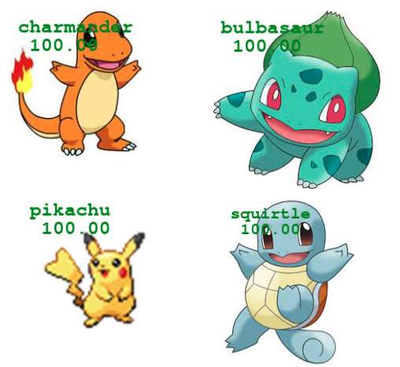
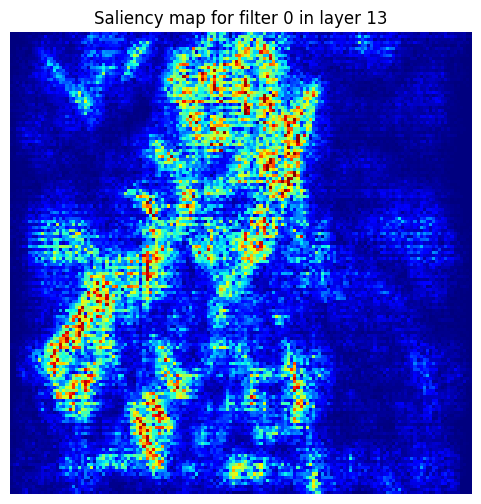
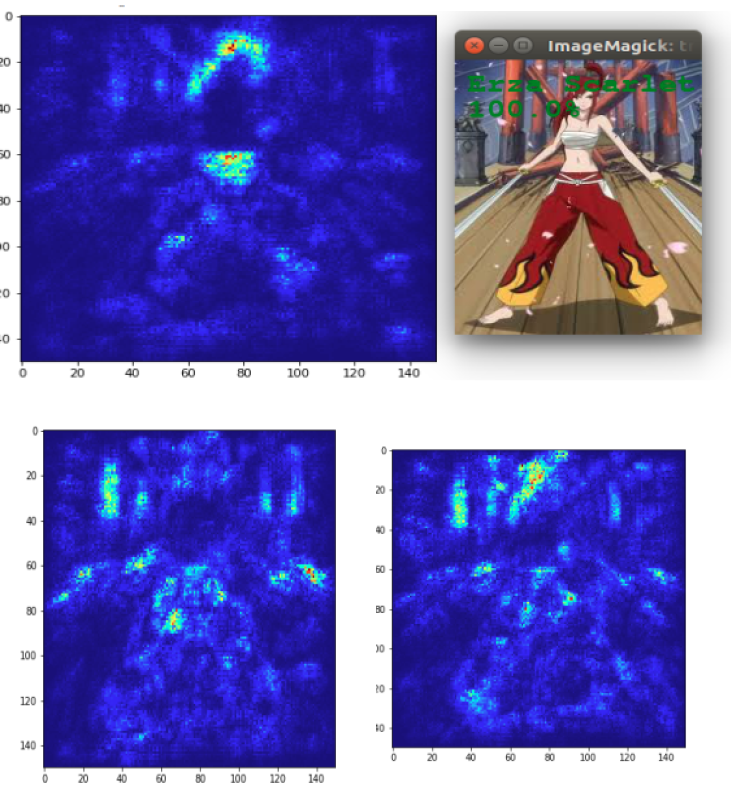

# Image Classification Project with CNN

## 🌍 Multilingual README Versions

- 🇫🇷 [Français](./README.fr.md)
- 🇬🇧 [English (you are here)](#)
- 🇪🇸 [Español](./README.es.md)

---

## 📘 Project Overview

This project, undertaken as part of my Master's degree, aims to create an **image classification system** using **Convolutional Neural Networks (CNNs)** with **Keras**. The project involves scraping images to build datasets, followed by training CNN models for classification.

---

## 📁 Project Structure

This project is organized into several main folders, each containing specific elements:

* `code/`: This folder gathers all Python scripts and Jupyter notebooks dedicated to **creating**, **training**, and **loading** classification models.
* `data/`: This folder contains the project's various **datasets**, including **Dragon Ball**, **Fairy Tail**, and **Pokémon**, organized for training, validation, and prediction.
* `modele/`: This folder stores the **trained and saved CNN models** for each dataset, comprising their architecture, weights, and associated class labels.

```
code/
├── Creer_model.ipynb   # Jupyter Notebook for model creation
├── creer_model.py      # Python script for model creation
├── Load_model.ipynb    # Jupyter Notebook for model loading
└── load_model.py       # Python script for model loading
data/
├── dragonball/
│   ├── predict/    # Images for prediction
│   ├── train/      # Images for training
│   │   ├── gohan/
│   │   ├── goku/
│   │   ├── piccolo/
│   │   └── vegeta/
│   └── validation/ # Images for validation
│       ├── gohan/
│       ├── goku/
│       ├── piccolo/
│       └── vegeta/
├── fairytail/
│   ├── predict/    # Images for prediction
│   ├── train/      # Images for training
│   │   ├── erza_scarlet/
│   │   ├── grey_fullbuster/
│   │   ├── lucy_heartfilia/
│   │   └── natsu_dragneel/
│   └── validation/ # Images for validation
│       ├── erza_scarlet/
│       ├── grey_fullbuster/
│       ├── lucy_heartfilia/
│       └── natsu_dragneel/
└── pokemon/
├── predict/    # Images for prediction
├── train/      # Images for training
│   ├── bulbasaur/
│   ├── charmander/
│   ├── pikachu/
│   └── squirtle/
└── validation/ # Images for validation
├── bulbasaur/
├── charmander/
├── pikachu/
└── squirtle/
modele/
├── dragonball_model/
│   ├── architecture.json  # Model architecture
│   ├── poids.h5           # Model weights
│   └── labels.txt         # Class labels
├── fairytail_model/
│   ├── architecture.json  # Model architecture
│   ├── poids.h5           # Model weights
│   └── labels.txt         # Class labels
└── pokemon_model/
├── architecture.json  # Model architecture
├── poids.h5           # Model weights
└── labels.txt         # Class labels
```

---

## 📊 Datasets
For this project, we created **three distinct datasets**, each consisting of **four classes**. Images were primarily scraped from **Google Images** and **Anime Characters Database**.

* **Dragon Ball**
    * Train: Gohan (34), Goku (42), Piccolo (20), Vegeta (44)
    * Validation: Gohan (5), Goku (21), Piccolo (7), Vegeta (15)


* **Fairy Tail**
    * Train: Erza Scarlet (22), Grey Fullbuster (15), Lucy Heartfilia (25), Natsu Dragneel (13)
    * Validation: Erza Scarlet (5), Grey Fullbuster (5), Lucy Heartfilia (6), Natsu Dragneel (6)


* **Pokémon**
    * Train: Bulbasaur (100), Charmander (96), Pikachu (156), Squirtle (102)
    * Validation: Bulbasaur (30), Charmander (23), Pikachu (38), Squirtle (28)

---

## 🖼️ Data Augmentation
Data augmentation is an essential technique to **improve model robustness** and **prevent overfitting** by creating new training images from existing ones. Here are the transformations applied in this project:

* 📏 **Rescaling**: Image pixel values are scaled to a range between 0 and 1. This is a crucial **normalization** step for neural network processing.


* ✂️ **Shear Range**: Images are "sheared" or distorted along an axis. This helps the model recognize objects from **various angles or perspectives**.


* 🔍 **Zoom Range**: Random zooms are applied to images. This transformation allows the model to better identify features, regardless of their **size or relative distance** within the image.


* ↔️ **Horizontal Flip**: Images are randomly flipped horizontally. This is particularly useful for objects that can appear in any **lateral orientation**, such as most characters or objects.

---

## ⚙️ How a CNN Works

A **Convolutional Neural Network (CNN)** is a type of neural network specifically designed to process grid-like data, such as images. Its effectiveness lies in its ability to automatically learn relevant features directly from images, without human intervention.

Here's how it operates, step by step:

* 🔎 **Feature Extraction (Convolutional Layers)**: At the heart of a CNN are the convolutional layers. They apply "filters" (small matrices of numbers) across the image. Each filter is designed to detect a specific type of pattern, such as **edges**, **textures**, or **simple shapes**. By sliding this filter across the entire image, the convolutional layer creates a "map" indicating where these patterns are present and their intensity. The network progressively learns which filters are most useful for the given task.


* 🔽 **Complexity Reduction (Pooling Layers)**: After convolution, pooling layers come into play. Their role is to **reduce the dimensionality** of the feature maps. They aggregate information by retaining only the most significant values (for instance, the maximum value in a small region). This helps make the model more robust to minor variations in pattern position and reduces computational cost.


* 🧠 **Complex Pattern Learning and Classification (Dense Layers)**: The processed and simplified information from the convolutional and pooling layers is then "flattened" and fed into "dense" or "fully connected" neuron layers. This is where the network learns to **combine high-level features** detected earlier to identify more complex patterns and, ultimately, make a **classification decision**. For example, after detecting eyes and a nose, the dense layers will learn to assemble them to recognize a specific face.

By repeating this process through several convolutional and pooling layers, followed by dense layers, the CNN builds a **hierarchical representation** of the image, moving from the simplest features (edges) to the most complex (entire objects), allowing it to classify images with high accuracy.

---

## 🧱 CNN Architecture

Here's a diagram of our CNN model's architecture, illustrating the data flow through its different layers:


---

## 🧪 Results and Experimental Approach

This project followed a progressive experimental approach, aiming to explore the capabilities and limitations of CNNs in the image classification of manga and anime characters.

### 1. Pokémon Classification

We began by training our models on the Pokémon dataset, composed of four classes (Bulbasaur, Charmander, Pikachu, Squirtle). The initial objective was to validate the basic CNN architecture and achieve satisfactory performance on a relatively simple task.



*Example of successful predictions on Pokémon images.*

### 2. Evolution Detection

We then tested the model's ability to generalize to images of Pokémon evolutions (e.g., Bulbasaur, Ivysaur, Venusaur). The idea was to see if the model could correctly attribute an image to its pre-evolution's class, even if the image showed significant visual differences.


*Results of Pokémon evolution classification.*

### 3. Multiple Detection and Fusions in Dragon Ball

Moving to a more complex dataset (Dragon Ball), we explored the detection of multiple characters within the same image.


*Examples of detecting multiple characters in the same image.*

We also tested the model on fusion images (like Gogeta), where a character is visually composed of parts of two others (Goku and Vegeta). The objective was to see if the model could identify similarities with the "parent" characters.


*Prediction on Gogeta images.*

Finally, we tested the model on images of Trunks (Vegeta's son) to see if it could detect common traits with his father, despite notable visual differences.


*Prediction on Trunks images.*

### 4. Explainability of Results

To better understand the model's decisions, we explored explainability techniques.

* **Feature Map Visualization**: We extracted *feature maps* from the convolutional layers to visualize the patterns the model learned to detect. For example, we could observe maps highlighting a character's general silhouette, or specific parts like arms or legs.

    

    *Example of feature maps showing pattern extraction in a manga image.*


* **Saliency Maps**: We generated saliency maps, which indicate the most important regions of the image for the model's prediction. We applied this technique to Dragon Ball images.

    
    

    *Saliency map for Dragon Ball images.*


Furthermore, we visualized saliency maps for each convolutional block during the prediction of a Fairy Tail character, to observe how the important regions evolve as the CNN processes the image.



*Saliency maps for each convolutional block during the prediction of a Fairy Tail character.*

---

## 💻 Technologies Used

* **Language:** Python
* **Libraries:** Keras

---

## 🚀 How to Run the Project

To run this project and use the image classification models, follow these steps:

1.  **Clone the repository**:
    ```bash
    git clone [https://github.com/Fab16BSB/image_classification.git](https://github.com/Fab16BSB/image_classification.git)
    ```

2.  **Install dependencies**:
    ```bash
    cd image_classification
    pip install -r requirements.txt
    ```

3.  **Execute the code**:

    * To **create and train a new model**, use the files in the `code/` folder:
        * Via Jupyter Notebook: Open `Creer_model.ipynb` and run the cells.
        * Via Python script: Run `python code/creer_model.py` from the project root.

    * To **load an existing model and make predictions**, use the files in the `code/` folder:
        * Via Jupyter Notebook: Open `Load_model.ipynb` and run the cells.
        * Via Python script: Run `python code/load_model.py` from the project root.

---

## 🧑‍💻 Authors

- [Zeineb Ghrib]: Contributed to building the Pokémon dataset and participated in the CNN model creation.

---

## 📚 Sources

The data used for this project was collected from the following platforms, with specific sources for each dataset:

* **Google Images**: Used for scraping the Pokémon dataset.
* **Anime Characters Database**: The source used for the Dragon Ball and Fairy Tail datasets.
